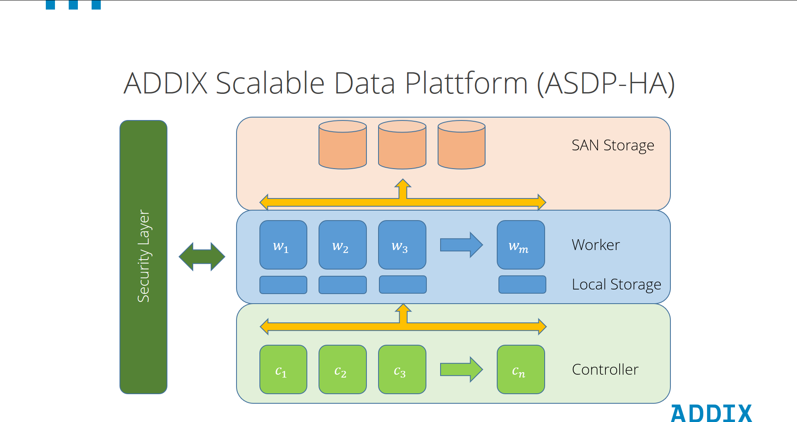

# MLA Kielregion

Die Datenplattform der KielRegion basiert auf der skalierbaren ADDIX Datenplattform 2.0 und dem ADDIX ASDP Architekturmodell und firmiert unter dem Projektnahmen "Mobility Live Acess", kurz MLA. Versionsstände sind vom Zeitpunkt der Erstellung dieser Dokumentation und können vom aktuellen Stand des MLA abweichen.

## Der Cluster
Basis der Komponenten des MLA ist ein K8S Kubernetes Cluster.

Durch die flexible und skalierbare Architektur auf Basis von Kubernetes lassen sich so weitere Ausbaustufen je nach aktuellem Leistungsbedarf und aktuellen Anforderungen nahezu beliebig anpassen.

Die Plattform bietet unter anderem ein umfangreiches Rechtemanagement

* Tenant-Management auf Basis von Realms
* User-Management pro Tenant
* Zugriffsmanagement pro User und Realm
  * Zugriffsbeschränkungen auf Basis von Datenmodellen
  * Zugriffsbeschränkungen auf Basis von Applikationen
  * Zugriffsbeschränkungen auf Basis von Datentypen

## Services

Im Cluster sind neben den zum sinnvollen Betrieb eines K8S-Clusters notwendigen Diensten die nachfolgenden relevanten Services für den MLA im Einsatz:

| Name             | Beschreibung                      | Version           | Bemerkung                   |
|:-----------------|:----------------------------------|:------------------|:----------------------------|
| Keycloak         | Keycloak ist ein Open-Source-Softwareprodukt, das Single Sign-On mit Identitäts- und Zugriffsmanagement für moderne Anwendungen und Dienste ermöglicht. | 22.0.3            |                             |
| APISIX           | Apache APISIX ist ein Cloud-Native API Gateway. Es bietet umfangreiche Funktionen zur Verwaltung des Datenverkehrs wie Load Balancing, Dynamic Upstream, Canary Release, Circuit Breaking, Authentifizierung, Observability usw.| 3.8.0             |                             |
| APISIX Dashboard | Das Apache APISIX Dashboard wurde entwickelt, um den Benutzern die Bedienung von Apache APISIX über ein Frontend-Interface so einfach wie möglich zu machen. | 3.0.0             |                             |
| Node-RED          | Node-RED ist ein Programmierwerkzeug, mit dem sich Hardwaregeräte, APIs und Online-Dienste auf neue und interessante Weise miteinander verbinden lassen. Es bietet einen browserbasierten Editor, der es einfach macht, Abläufe unter Verwendung der breiten Palette von Knoten zu verdrahten, die mit einem einzigen Mausklick zur Laufzeit bereitgestellt werden können. | 3.1.10            | Spezielles Image mit zahlreichen Erweiterungen durch ADDIX erstellt. |
| Busimporter      | Der Busimporter liefert Echtzeitdaten zu verschiedenen Parametern der KVG-Busse. | 1.1.14            | kein Open Source, Entwicklung durch ADDIX |
| Grafana          | Grafana Infoportal. Visualisierung von Daten mittels Grafana-Dashboards | 10.4.2            |                             |
| IDAS             | Der E-Mail-Alarmierungsservice bei definierten Grenzwertüberschreitungen von NGSI-Entitäten. | 3.0.1             | kein Open Source, Entwicklung durch ADDIX |
| Masterportal     | Das Masterportal ist ein Open Source Geoportal | 0.7.9             | angepasste Version auf Basis der Masterportal Version 2.33.0                      |
| Nominatim        | Nominatim verwendet OpenStreetMap-Daten, um Orte auf der Erde nach Namen und Adresse zu finden (Geokodierung). Es kann auch den umgekehrten Weg gehen und eine Adresse für einen beliebigen Ort auf der Erde finden. | 4.5               |                             |
| Hanseatics mobil.live   | mobil.live ist eine Mobilitätsanwendung der KielRegion, welche die verschiedenen Mobilitätsangebote auf jedem webfähigen Gerät, wie Smartphones oder Tablets darstellt. Die in der Anwendung angezeigten Mobilitätsangebote werden vom MLA abgerufen                     | 2.4.4             |                             |
| Quantumleap      | QuantumLeap ist eine API, die die Speicherung von FIWARE NGSI-Daten in eine Zeitreihen-Datenbank unterstützt. | 1.0.0             |                             |
| TimescaleDB       | PostgreSQL mit einer Erweiterung für Zeitreihen | pg14.6-ts2.9.1-p1 |                             |
| Valkey           | Valkey ist ein quelloffener (BSD) Hochleistungs-Schlüssel/Wert-Datenspeicher, der eine Vielzahl von Arbeitslasten wie Caching und Nachrichtenwarteschlangen unterstützt und als primäre Datenbank fungieren kann. Valkey kann entweder als eigenständiger Daemon oder in einem Cluster laufen, mit Optionen für Replikation und Hochverfügbarkeit. | 7.2.6             |                             |
| Scorpio Broker   | Scorpio ist ein NGSI-LD-konformer Kontextbroker, der von NEC Laboratories Europe und NEC Technologies India entwickelt wurde. Er implementiert die vollständige NGSI-LD-API gemäß der Spezifikation der ETSI Industry Specification Group on cross cutting Context Information Management (ETSI ISG CIM). | 5.0.6 |                             |
| RabbitMQ         | RabbitMQ ist ein zuverlässiger und ausgereifter Messaging- und Streaming-Broker, der sich leicht in Cloud-Umgebungen, vor Ort und auf einem lokalen Rechner einsetzen lässt. | 4.0.4 | Im MLA wird er insbesondere für den Scorpio Broker verwendet. |
| PostgreSQL       | PostgreSQL ist ein leistungsfähiges, objektrelationales Open-Source-Datenbanksystem, das seit mehr als 35 Jahren aktiv entwickelt wird und sich einen guten Ruf in Bezug auf Zuverlässigkeit, Robustheit der Funktionen und Leistung erworben hat. | 17.2.0            | Datenbank für den Scorpio Broker |
| Trafficsign      | Trafficsign überwacht definierte Entitäten auf Veränderung und löst Prozessketten aus um die daraus resultierenden Informationen an die Verkehrsinfotafeln zu übertragen und dort anschließend entsprechende Programme anzufordern | 1.0.0             | kein Open Source, Entwicklung durch ADDIX |
| nginx            | nginx ist ein HTTP-Webserver, Reverse Proxy, Content Cache, Load Balancer, TCP/UDP-Proxyserver und Mail-Proxyserver. | 1.23.3            | Einsatz als Lieferant für Bilder und Icons für andere Dienste. |
| SCD              | Smartcity Dashboard von EDAG                      | 0.19.1 | https://github.com/triveme/smartcity-dashboard |

## License
Copyright ©2024 ADDIX GmbH.